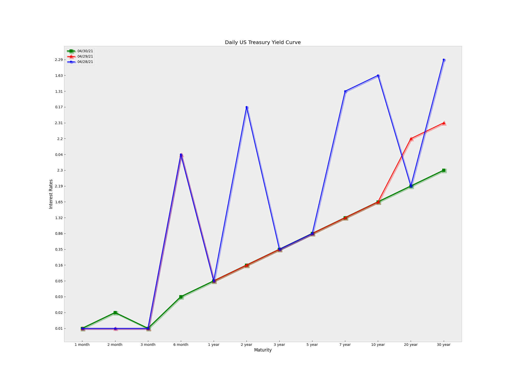

# week-29-project

<!-- 

 -->

## Contents

- [Introduction](#introduction)
- [Technology Used](#technology-used)
- [Web Scraping](#)
- [Chart](#hypothesis)

# Treasury Yield Curve Rates
## Purpose of Project
**The [data](https://www.treasury.gov/resource-center/data-chart-center/interest-rates/Pages/TextView.aspx?data=yield) is found in the US Department of the Treasury.**

The goal of this project was to write a python script that scrapes the daily treasury yield curve rates and produces a matplotlib chart of the current yield curve. 

 

## Technology Stack
I used python as the primary programming language. Some of the packages I used are
| Library | Description |
| --- | --- |
| [Matplotlib](https://matplotlib.org/) | Matplotlib is an extremely versatile library of tools for generating interactive plots that are easy to interpret and customise. |
| [Pandas](https://pandas.pydata.org/pandas-docs/stable/user_guide/10min.html) | Pandas is another library for data science that is just as popular as numpy. It provides easy to use data structures and functions to manipulate structured data. |
| [flask](https://flask.palletsprojects.com/en/1.1.x/) |Flask is a micro web framework written in Python. It is classified as a microframework because it does not require particular tools or libraries|
| [Sqlite3](https://www.sqlite.org/index.html) | Sqlite3 is a C library that provides a lightweight disk-based database that allows accessing the database using a nonstandard variant of the SQL query language. |
| [requests](https://www.w3schools.com/python/module_requests.asp) | The requests module allows you to send HTTP requests using Python. |

These tools are well documented and come with several examples that make it easy to start using them. You can check out the linked documentation pages for more information.

## Web Scraping using requests and Beautifulsoup

### How did I get the daily yield curve rates?
- The HTTP request returns a Response Object with all the response data
- I used beautifulsoup to parse through this response data to extract the table that contains the daily yield curve rates
- Method soup.findAll() was used to find the 'th' and 'td' tags, which contained the names of columns and data points, respectively

## Chart Created to Display the Treasury Yield Curve

  

